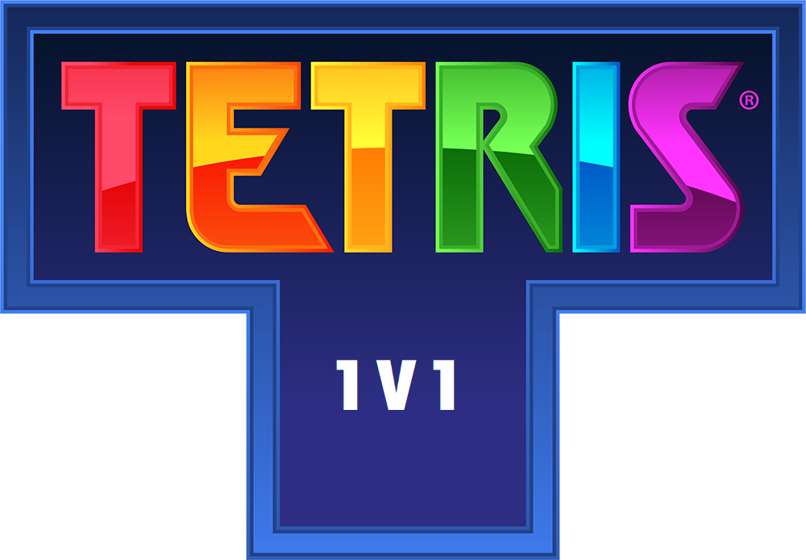

# Tetris 1v1

## Overview

This repository contains the source code for a multiplayer Tetris game built with React for the front end, Koa for the back end, and Socket.IO for enabling real-time multiplayer functionality. Unlike traditional Tetris games, this implementation allows players to compete head-to-head in a thrilling Tetris 1v1 showdown.

## Features

- **Multiplayer Tetris 1v1:** Challenge your friends or random opponents to a Tetris duel in real-time
- **Add blocks to your opponent side:** Each time you complete a line. You'll add a block obstructing opponent side
- **React Front End:** A modern and responsive user interface built with React for an engaging gaming experience.
- **Koa Back End:** Utilizes the Koa framework for a lightweight and efficient server to handle game logic and communication.
- **Socket.IO Integration:** Enables real-time communication between players, ensuring seamless and synchronized gameplay.
- **Scoring and Win Tracking:** Keep track of scores and victories as you compete with others.

## Getting Started

### Prerequisites

- Node.js and npm installed on your machine.
- Clone the repository: `git clone https://github.com/your-username/Tetris.git`
- Change into the project directory: `cd Tetris`

### Installation

[Need to review this part]

### Usage

[Need to review this part]

## Controls

- Move Left: [Left Arrow]
- Move Right: [Right Arrow]
- Rotate: [Up Arrow]
- Soft Drop: [Down Arrow]
- Hard Drop: [Spacebar]

## Multiplayer Gameplay

1. Access the game in your browser.
2. Share the generated room code with your opponent.
3. Compete in a Tetris 1v1 match in real-time.

## Screenshots

[Insert any additional relevant screenshots]
